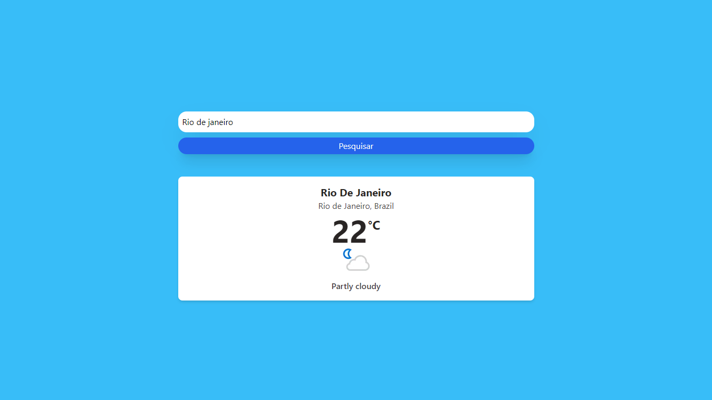
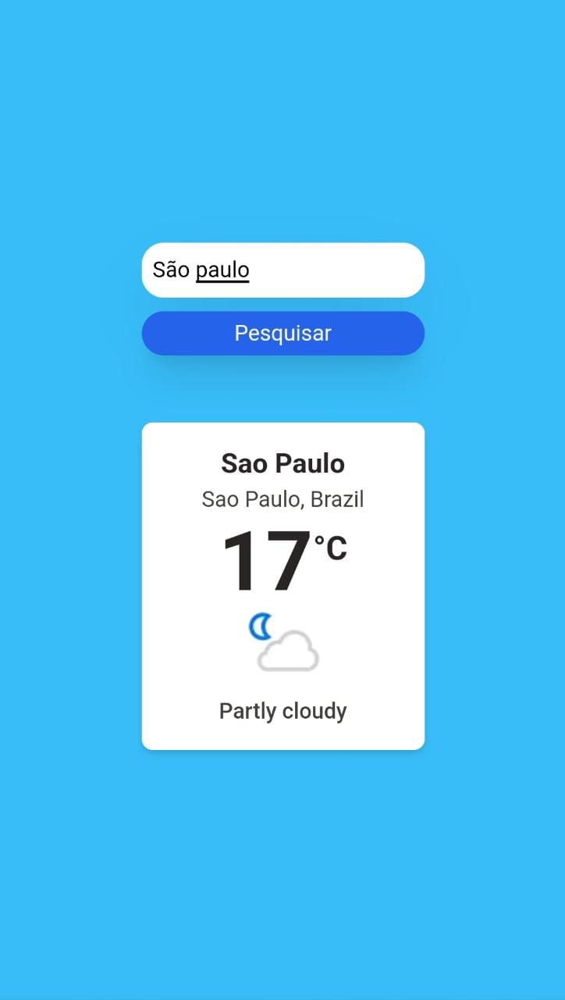

<h1 align="center">Weather Now</h1>

Versão Desktop

  

Versão Mobile
  

    

#

## Tecnologias

Para desenvolver esse projeto eu utilizei as seguintes tecnologias:
 

- React.JS e Tailwind CSS

## Projeto

Um app que possibilita a visualização em tempo real do clima em Grau Celsius e também a atual situação climática.

## Deploy

Link para acessar o projeto: https://weather-app-vite-react.vercel.app/